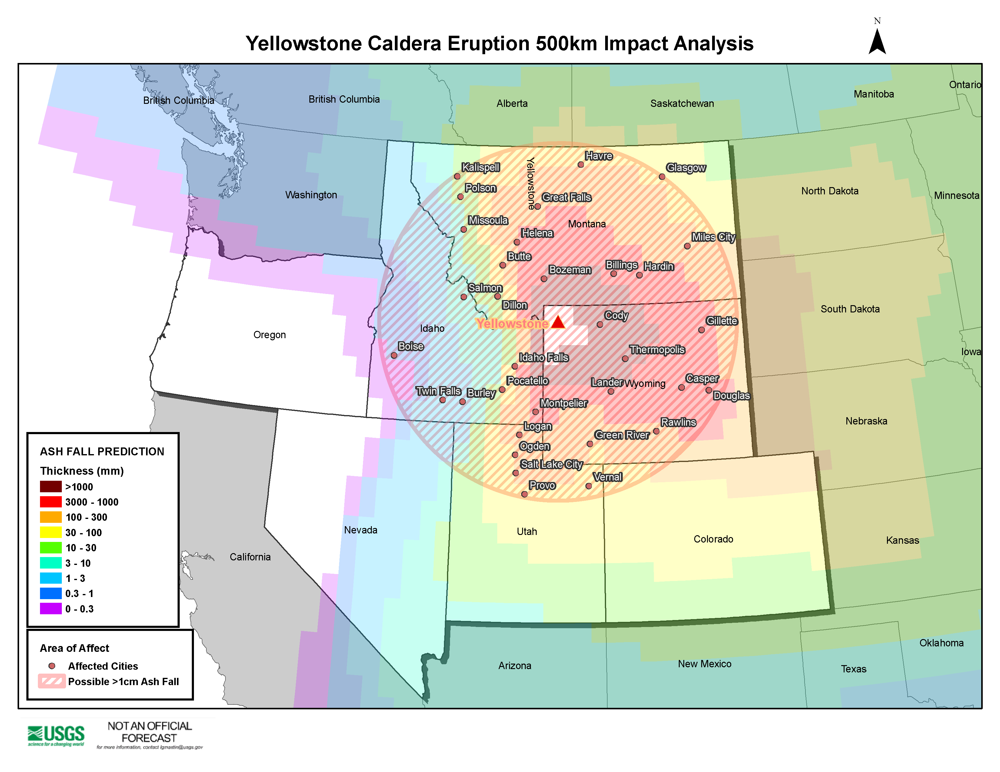
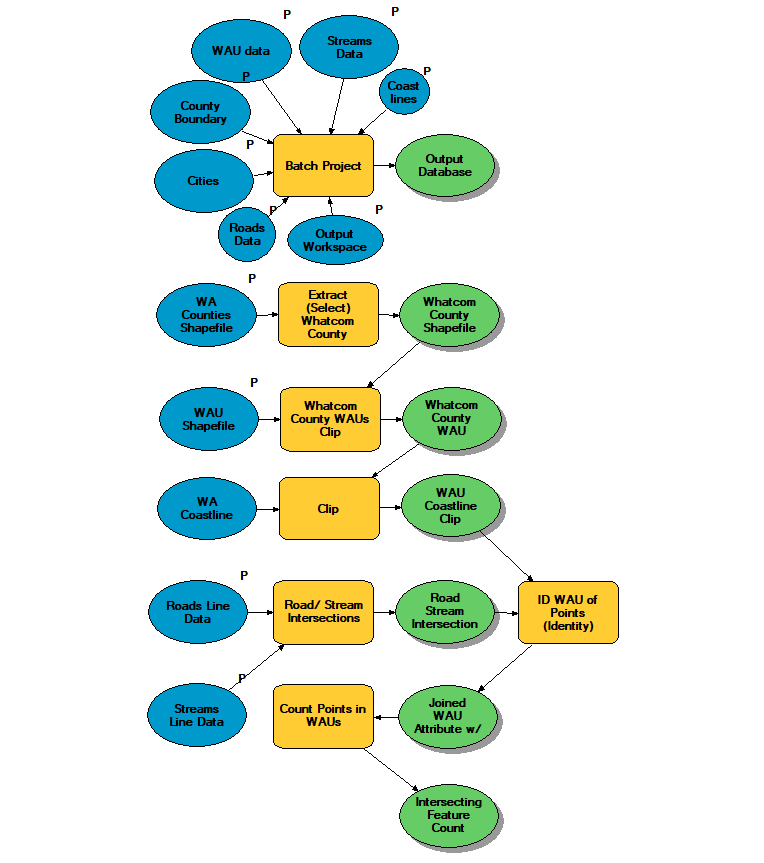

This lesson was designed to explore distortions of distance and area by different projections, examining geospatial metadata, customizing a projection for a map, and using geoprocessing tools to identify features within a specified distance of some other feature.

## Yellowstone

This task was simple:

> *Evaluate projections of existing data and reproject if necessary*\
> *Produce a map of USGS ash fall predictions during a hypothetical Yellowstone Caldera eruption*\
> *Identify all the cities within 500 km of the caldera that may receive greater than 1 cm of ash fall*

ArcMap allows the user to define their own projections. In my case, I wanted to define the extent of my equal area projection in order to reduce distortion around my subject area (Yellowstone).  I extracted cities using a 500 km buffer around the centroid of the caldera and the SELECT BY LOCATION tool to create a new feature class containing the affected cities. Although the task only asked for cities within 500 km of the caldera, I wanted to show the actual ash fall predictions on my map. I converted tabular prediction data from the USGS into a classified raster for visualizing the modeled ash fall.

## Density Analysis

This task was more complex:

> *Reproject or fix projections and clip existing data to project area (Whatcom County, WA)*\
> *Determine where roads and streams intersect*\
> *Determine density of road/stream crossings in each watershed administrative unit (WAU)*\
> *Create choropleth map showing crossing density in each WAU*

This analysis was meant to be reproducible through the use of ModelBuilder for all data management and geoprocessing; my model can be seen below the map.

Here is my final model for my analysis:

