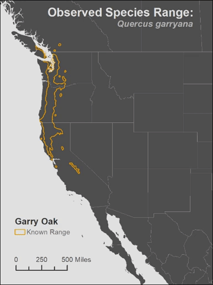
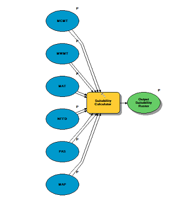

This lesson a cumulative application of the skills we developed in this course. We used data from the [GESC](https://www.usgs.gov/centers/gecsc/data-tools) to develop products from.

### GIS Modeling of Climate Change Impacts on *Q. garryana* (a.k.a Oregon White Oak Garry Oak)

> * Analyze potential future climate change impacts on forests in western North America
>
>   Develop a GIS-based model to quantify projected shifts in the range of Q. garryana under various climate change scenarios for the late 21st century
>
>   Test model and format it so that it will be easy to re-use it with other projections of future climate conditions

#### My full report can be found {}here{}.

The production of the Q. garryana model required advanced use of ***Raster Calculator*** expressions. It was very important that I understood the metadata of the underlying data and my early preparations were focused primarily on planning my processing steps carefully. I developed a historical climate envelope using ***Zonal Statistics As Table*** to find the mean of each climate variable plus or minus 1.5 standard deviations. I adjusted this range until the output for each climate variable appeared to match the known range of Q. garryana. I then used ***Raster Calculator***  to create binary output raster for each climate variable. These binary rasters were combined to create my final suitability maps. A model was created to repeat this process for each future climate projection. Lastly, I subtracted my 20th century suitability from the 2080 suitability to map the change in suitability.

The map series I created for this report can be seen below:

A model containing the input climate variables with their respective binary calculation and the final suitability output:

Each input is parameterized and can be rerun to include different datasets.