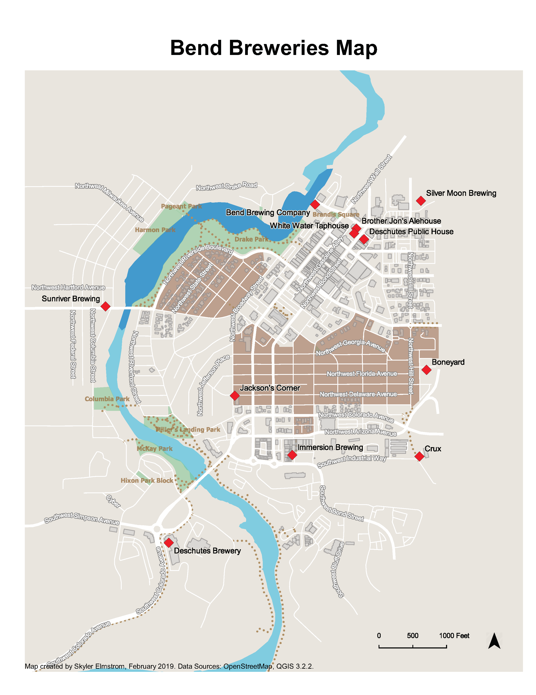
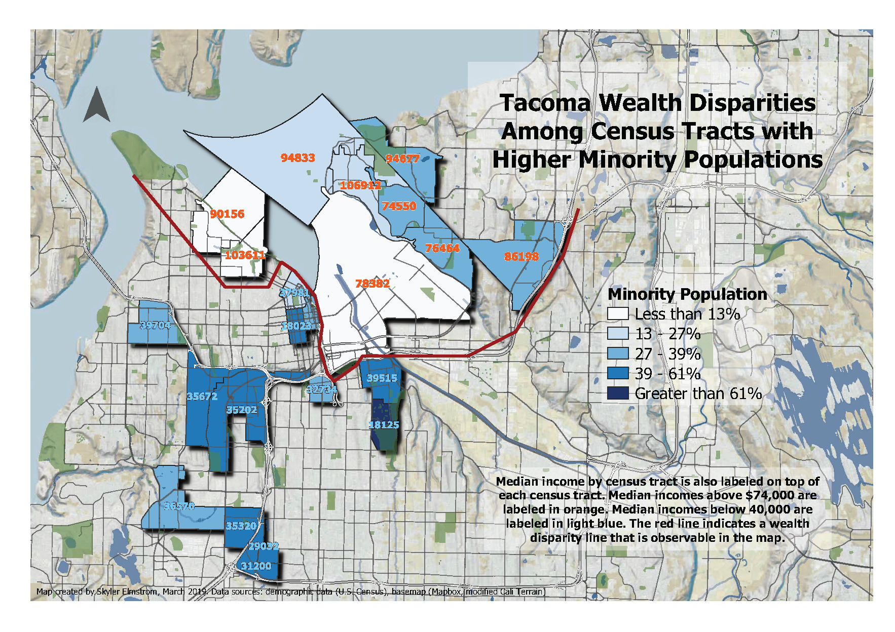

## **Open Source GIS Workshop - Winter 2019**

This workshop by Jonathon A. Kemp provided me with my fundamental understanding of open-source options for GIS such as *QGIS*, *Leaflet* (web mapping API), and *MapBox* (customizable base map service).

 

Skills learned:

* **QGIS Basics**: Projecting Data, Definition Queries, Python, QGIS "composer"

*  **QGIS Advanced**: Deploying to the Web, Web Mapping APIs, OpenStreetMap, Geoprocessing, Summary Statistics, Field Calculator + Expressions

*  **MapBox**: Designing Custom Basemaps

*  **Leaflet API**: Deploying a Simple Web Map to Github

 

Examples of my work in this workshop using QGIS and MapBox service layers:

