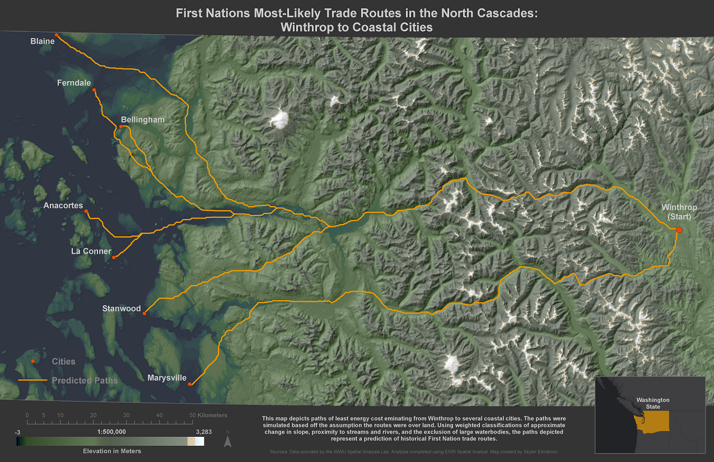
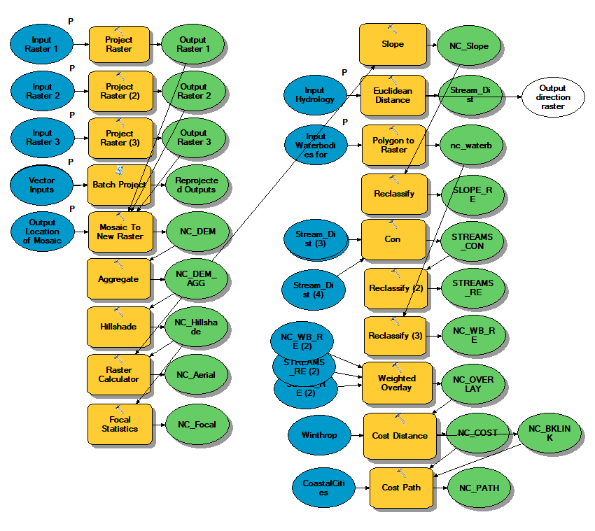

This lesson was on using raster tools within ArcGIS such as ***Raster Datasets***, ***Aggregate, Raster Calculator, Focal Statistics, Reclassify, Slope, Weighted Overlay,*** and ***Least-Cost Path***  with a focus on using *ModelBuilder* to create reproducible workflows.

Cost-Path Analysis

> Help pinpoint potential archaeological sites by estimating least-cost path trade routes from Winthrop, WA to coastal WA areas assuming trade routes follow rivers and routes with relatively low cumulative slope.

To speed up creating raster layers for this lesson, I resampled elevation data to 50m cells using ***Aggregate***. I created a custom color ramp focused on low slope areas for my DEM which I overlayed with a hillshade. I used raster math to combine these layers into a single raster showing darker color at lower elevations and lighter at higher elevations to simulate an aerial view. Lastly, I used **Focal Statistics** to emphasize major geographic features while muting minor features to create a more generalized hillshade. The next part of the analysis was creating a cost-path based on my cost criteria following these general geoprocessing steps (specific tools in bold):

> Calculate Slope\
> Calculate Distance to Streams\
> Mask Water bodies\
> Reclassify Slope (Least to Most Costly: 1-10)\
> Exclude Outliers From Distance to Streams (***CON tool***; remove areas <1500m to nearest stream)\
> Reclassify Distance to Streams (Closest to Farthest: 1-10, equal intervals)\
> Reclassify Water Bodies (Waterbodies = 1, Other = No Data)\
> Create Cost Surface (***Weighted Overlay***; Reclassed Stream + Reclassed Slope)\
> Calculate Cost Paths (***Cost Distance***; cost surface to source \[Winthrop, WA])\
> Calculate Least-Cost Path (***Cost Path***; coastal cities as destinations, cost distance and backlinks)

A map including my final analysis:

My final model:

