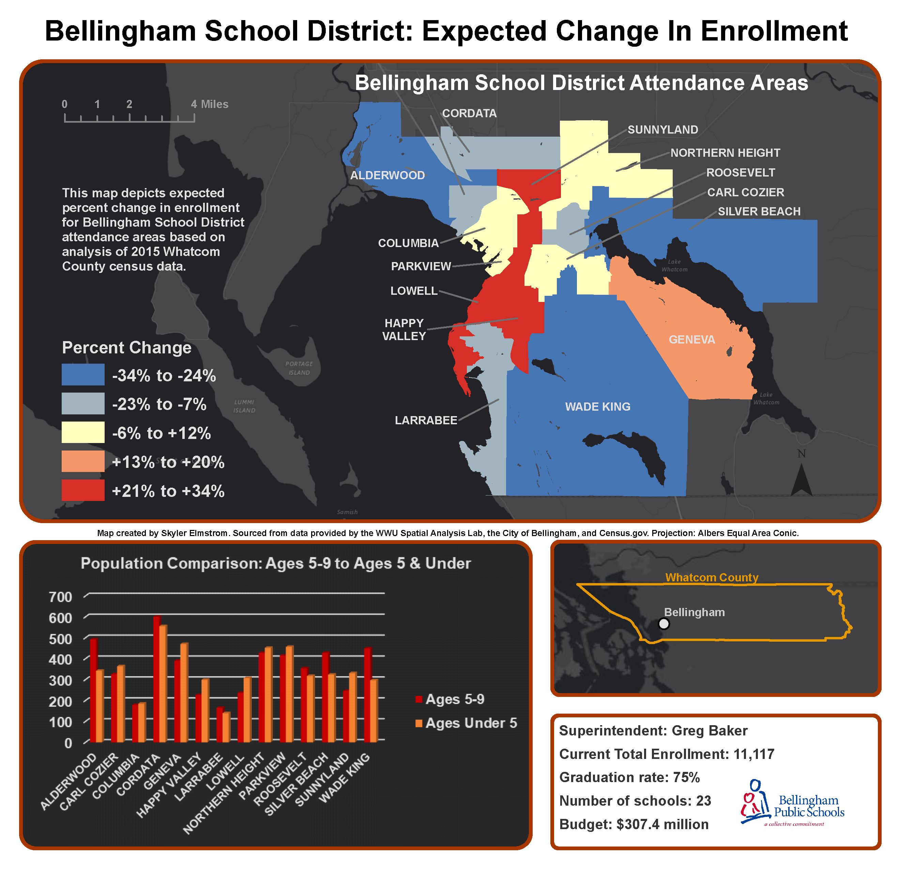

In this lesson, I learned how to download Census.gov data and format tabular demographic data to my needs. We applied ***Table Joins*** from the tabular data to our geographic data and used the ***Field Calculator*** to calculate new fields as necessary. Using ***Dissolve*** and ***Calculate Geometry***, we created polygons for storing future predictions of local school district enrollment.

### Enrollment Change Predictions

> * Assess future changes in enrollment in Bellingham elementary schools
> * Compile census dataset that shows the number of young children (ages 5-9) currently in each school attendance and the number of potential future students (age <5)
> * Map the likely enrollment change

Spatial data from the City of Bellingham provided me with attendance zones to use alongside my census data. In order to get an accurate measure of how many students live in a particular zone per unit area, I ***Erased*** areas with water-bodies, glaciers, and other features where people do not live from my census and attendance zone data. Finally, I used the ***Intersect*** tool to combine my datasets and calculate enrollment based on weighted areas within the attendance zones. The weights were created for each census block group based on area to account for them being split between attendance zone polygons.

